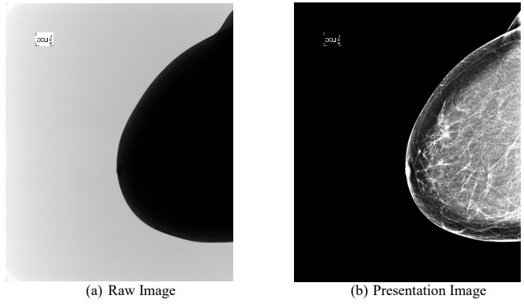
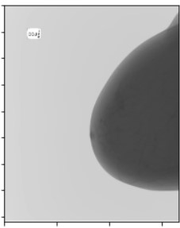
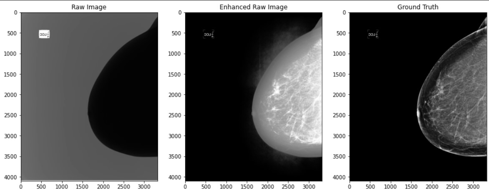
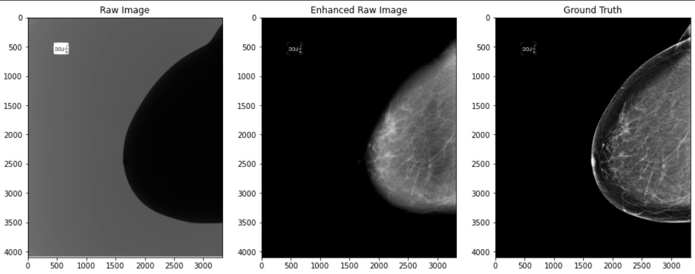

# Raw_to_Presentation_Mammography
Convert the RAW mammographic image to be similar to the PRESENTATION one using Python Script

## Objective
The objective is to Convert the (a) RAW mammographic image to be similar to the (b) PRESENTATION one using Python Script

## Steps
I. Convert 14 bits image to 8 bits image

    image = image * ((2**8)/(2**14))

II. Apply Log transformation

    val = image.max()
    c =  val / np.log(1 + np.max(image))
    log_image = c * (np.log(image + 1))

III. a) Apply image enhancement methods: **Histogram Equalization**

    cv2.equalizeHist(log_img)

III. b) Apply image enhancement methods: **Contrast Stretching**

    image = exposure.rescale_intensity(image, in_range=(0, 120))
    image = util.invert(image)

## Output
Log Transformation Output

Histogram Equalization Output

Contrast Stretching Output

## References
- https://www.pyimagesearch.com/2021/02/01/opencv-histogram-equalization-and-adaptive-histogram-equalization-clahe/
- https://scikit-image.org/docs/dev/auto_examples/color_exposure/plot_equalize.html
